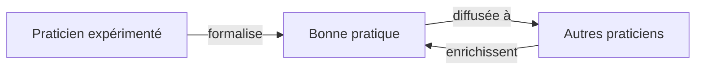

# Lugia & Co — La circulation du savoir
> Spécification · Partage de bonnes pratiques métier · Mai 2026

---

## Objet du document

Le partage de bonnes pratiques métier au sein de l'entreprise est une dimension distincte qui n'était couverte ni par la documentation (existence du savoir) ni par les processus (façon de faire). Ce document spécifie la dimension **Circulation du savoir** : comment ce qui fonctionne chez l'un se diffuse aux autres participants.

---

## Partie 1 — La distinction fondamentale

Une "bonne pratique métier" recouvre trois choses distinctes, qu'il faut séparer :

```
LE SAVOIR             → dimension Documentaire
                        (une procédure existe-t-elle, est-elle à jour ?)

LE PROCESSUS          → composante Processus du WSF
                        (la façon de faire est-elle bonne ?)

LA DIFFUSION          → dimension Circulation du savoir  ← CE DOCUMENT
                        (ce qui marche se diffuse-t-il aux autres ?)
```

Les deux premières étaient couvertes. La troisième — la **circulation du savoir entre les personnes** — manquait. C'est ce que cette spécification ajoute.

### La question centrale
> *"Est-ce que ce qui fonctionne bien chez l'un se diffuse aux autres, ou reste-t-il isolé dans des silos ?"*

---

## Partie 2 — Positionnement dans le WSF

La circulation du savoir est une **relation entre Participants**, médiée par la Documentation, portant sur des Processus.



Elle se situe à l'intersection de trois composantes :
- **Participants** : qui détient le savoir, qui le reçoit
- **Information / Documentation** : le savoir formalisé
- **Processus** : la bonne pratique est une façon de faire

Concrètement, elle se modélise comme un **flux de savoir** (nouveau type de liaison) entre participants.

### Le nouveau type de liaison
```
TypeLiaison {
  ...
  TRANSMET   // un participant transmet un savoir à un autre
}
```

---

## Partie 3 — Interne vs externe

Il faut distinguer deux niveaux de partage de bonnes pratiques.

```
PARTAGE INTERNE (ce document)        PARTAGE EXTERNE
──────────────────────────          ───────────────
Entre participants                   Entre cabinets différents
d'un même système de travail         du réseau Lugia & Co

Lentille "Circulation du savoir"     Apprentissage inter-cabinet
sur le jumeau du cabinet             (effet de réseau)

Ex : le médecin partage sa           Ex : "les cabinets comme le vôtre
méthode à son associé                s'organisent comme ça"
```

Ce sont deux mécaniques distinctes :
- **Interne** : circulation au sein du jumeau d'un cabinet → c'est l'objet de ce document
- **Externe** : diffusion à travers le réseau → relève de l'effet de réseau et de l'apprentissage inter-cabinet

Particulièrement pertinent pour les **cabinets de groupe et les MSP**, où plusieurs praticiens travaillent côte à côte sans toujours partager ce qui marche.

---

## Partie 4 — La lentille "Circulation du savoir"

### Ce qu'elle montre
Si le savoir qui fonctionne se diffuse aux participants qui en ont besoin, ou reste isolé.

### Question
*"Le savoir qui marche se diffuse-t-il, ou reste-t-il en silo ?"*

### Coloration
- Vert : savoir partagé, accessible à tous ceux qui en ont besoin
- Ambre : savoir partagé partiellement ou de façon informelle
- Rouge : savoir en silo, détenu par une personne, non diffusé

### Ce qu'elle révèle
- **Les silos de connaissance** : un praticien a une excellente méthode que personne d'autre ne connaît
- **Les goulots de transmission** : le savoir ne passe que par une personne
- **Les pratiques non capitalisées** : ce qui marche mais qu'on ne formalise jamais pour les autres

### Famille
Humaine / organisationnelle.

---

## Partie 5 — Le lien avec la fragilité

La circulation du savoir recoupe partiellement la lentille Fragilité, mais sous un angle différent.

```
FRAGILITÉ                          CIRCULATION
─────────                          ───────────
"Si cette personne part,           "Ce savoir ne profite qu'à une
on perd le savoir"                 personne alors qu'il pourrait
                                   profiter à tous"

→ angle RISQUE                     → angle OPPORTUNITÉ MANQUÉE
```

Le même silo de savoir est :
- Un **risque** (fragilité) : sa perte menace la continuité
- Une **opportunité gâchée** (circulation) : il pourrait bénéficier à tous

Deux lentilles, deux lectures du même fait. C'est légitime car elles répondent à deux questions distinctes (R1 des règles de conception).

---

## Partie 6 — L'échelle de diffusion (suivi fin)

Comme pour la maturité documentaire, chaque bonne pratique se situe sur une échelle précise — centrée cette fois sur la diffusion plutôt que sur la structuration.

```
NIVEAU  ÉTAT                              SIGNIFICATION
──────  ────────────────────────────────  ──────────────────────────────
  0     Pratique individuelle non         Quelqu'un fait bien sans
        identifiée                         que ce soit repéré
  1     Pratique identifiée comme bonne   On reconnaît qu'elle marche
  2     Formalisée                         Écrite, structurée, transmissible
  3     Partagée                           Rendue accessible aux autres
  4     Adoptée                            Réellement utilisée par d'autres
  5     Améliorée collectivement          Enrichie par le groupe
```

### Distinction avec la maturité documentaire
- **Maturité documentaire** : le document existe-t-il, est-il à jour, possédé ? (axe structuration)
- **Diffusion** : le savoir est-il partagé, adopté, enrichi ? (axe circulation)

Une bonne pratique peut être parfaitement documentée (niveau 6 documentaire) mais jamais diffusée (niveau 2 circulation). Les deux axes sont complémentaires.

### Maturité de circulation globale
```
maturite_circulation = Σ niveau_diffusion(pratique) / (nombre_pratiques × 5)
```

---

## Partie 7 — Comment le système aide

### Détecter les silos
Le jumeau identifie les savoirs détenus par une seule personne (croisement Participants × Processus × usage) et signale ceux qui gagneraient à être diffusés.

### Faciliter la formalisation
L'IA aide à transformer une pratique individuelle en bonne pratique partageable — même mécanisme que pour la documentation : du tacite vers l'explicite.
> Le praticien décrit sa méthode oralement, l'IA en fait une bonne pratique structurée et diffusable.

### Suivre la diffusion réelle
Mesurer si une bonne pratique formalisée est réellement adoptée par les autres, ou si elle reste lettre morte. La formalisation ne suffit pas — l'adoption compte.

### Créer une mémoire collective
Le jumeau du cabinet devient le dépositaire des bonnes pratiques validées — accessible à tous, enrichi par tous. Une base de savoir vivante du cabinet.

---

## Partie 8 — Les chantiers de circulation

### Chantier "Identifier les pépites"
Repérer les pratiques individuelles qui fonctionnent bien et mériteraient d'être partagées.

### Chantier "Briser un silo"
Prendre un savoir critique détenu par une seule personne, le formaliser et le diffuser. Double bénéfice : réduit la fragilité ET diffuse la valeur.

### Chantier "Capitaliser une bonne pratique"
Transformer une méthode éprouvée en bonne pratique documentée, partagée et suivie dans son adoption.

### Chantier "Onboarding par les bonnes pratiques"
Constituer le corpus de bonnes pratiques qui permet à un nouvel arrivant (associé, remplaçant, collaborateur) de monter en compétence rapidement.

---

## Partie 9 — Les bénéfices

| Bénéfice | Description |
|---|---|
| Montée en compétence collective | Le savoir d'un seul profite à tous |
| Réduction de la fragilité | Les savoirs critiques ne dépendent plus d'une personne |
| Homogénéité de la qualité | Tous les praticiens suivent les meilleures méthodes |
| Accélération de l'onboarding | Un nouvel arrivant accède au savoir capitalisé |
| Amélioration continue | Les pratiques s'enrichissent collectivement |
| Valorisation du cabinet | Un savoir collectif structuré est un actif transmissible |

### Pertinence par contexte
- **Cabinet solo** : circulation limitée (peu de participants), mais utile pour la transmission future et l'onboarding de remplaçants
- **Cabinet de groupe / MSP** : valeur maximale — plusieurs praticiens, fort potentiel de silos, gain collectif important

---

## Partie 10 — La synergie avec l'IA

Le même cercle vertueux que la documentation, appliqué à la diffusion.

```
L'IA aide à formaliser une pratique individuelle
            ↓
La pratique formalisée est partagée et adoptée
            ↓
L'IA s'appuie sur les bonnes pratiques du cabinet
pour assister tous les participants de façon cohérente
            ↓
Le savoir collectif s'enrichit
            ↓
(la boucle se renforce)
```

### Effet spécifique
Quand les bonnes pratiques sont capitalisées dans le jumeau, l'IA peut assister chaque participant **selon les méthodes validées du cabinet** — pas selon des standards génériques. L'assistant devient le gardien et le diffuseur des bonnes pratiques maison.

---

## Synthèse

```
LA CIRCULATION DU SAVOIR
│
├── Une dimension distincte : la DIFFUSION du savoir
│   (≠ documentation = existence, ≠ processus = façon de faire)
│
├── Une relation entre PARTICIPANTS (nouveau lien : TRANSMET)
│   médiée par la Documentation, portant sur des Processus
│
├── Distinction INTERNE (ce doc) / EXTERNE (inter-cabinet)
│
├── Une lentille "Circulation du savoir"
│   Question : le savoir qui marche se diffuse-t-il ?
│   Recoupe la Fragilité (angle opportunité vs risque)
│
├── Une échelle de diffusion 0 à 5
│   individuelle → identifiée → formalisée → partagée → adoptée → améliorée
│
├── Des chantiers dédiés (identifier les pépites, briser les silos…)
│
└── En synergie avec l'IA
    l'IA formalise et diffuse ↔ assiste selon les pratiques maison

Valeur maximale en cabinet de groupe / MSP.
```

> **Le partage de bonnes pratiques transforme le savoir individuel en patrimoine collectif. Lugia & Co détecte les silos, facilite la formalisation, et suit la diffusion réelle — pour que ce qui marche chez l'un profite à tous.**

---

*Spécification de la circulation du savoir — Lugia & Co — Mai 2026*
*À lire avec la dimension documentaire, la bibliothèque de lentilles et la spécification du jumeau*
