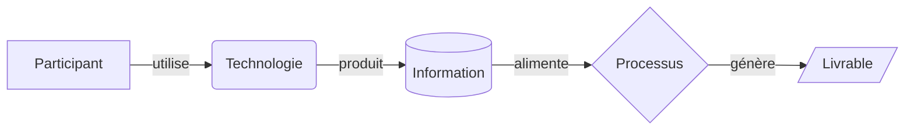
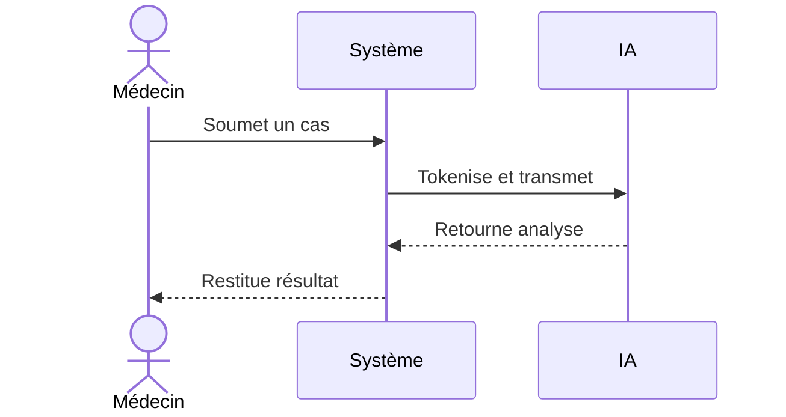
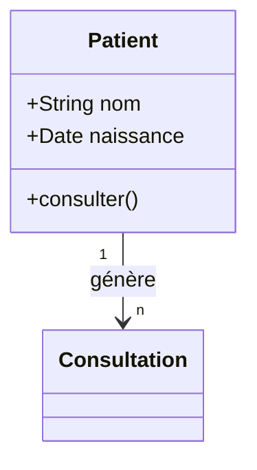
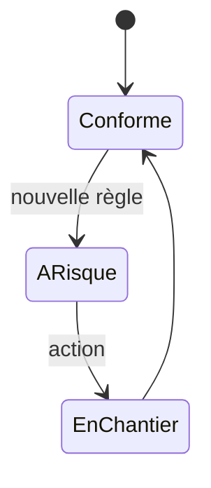
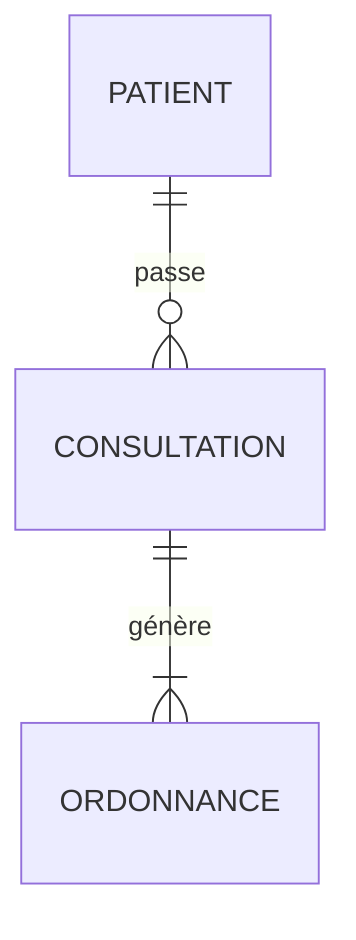
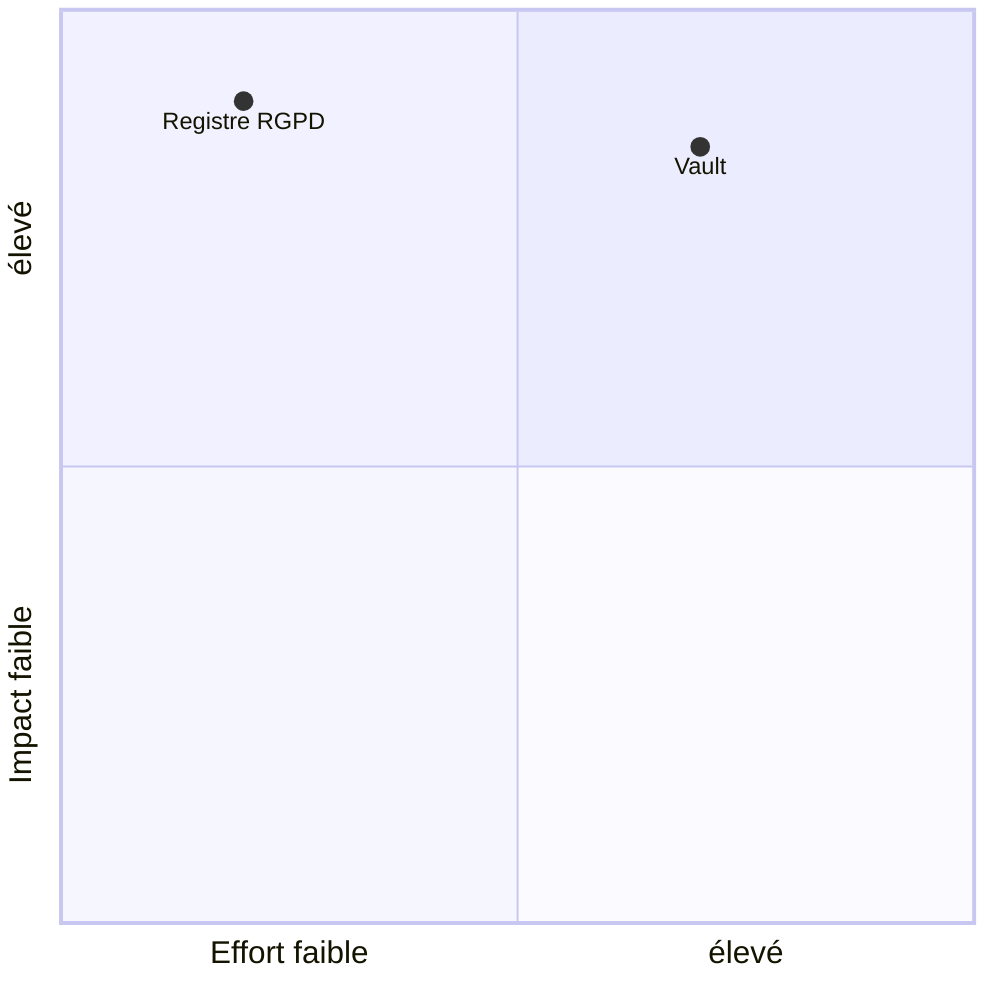
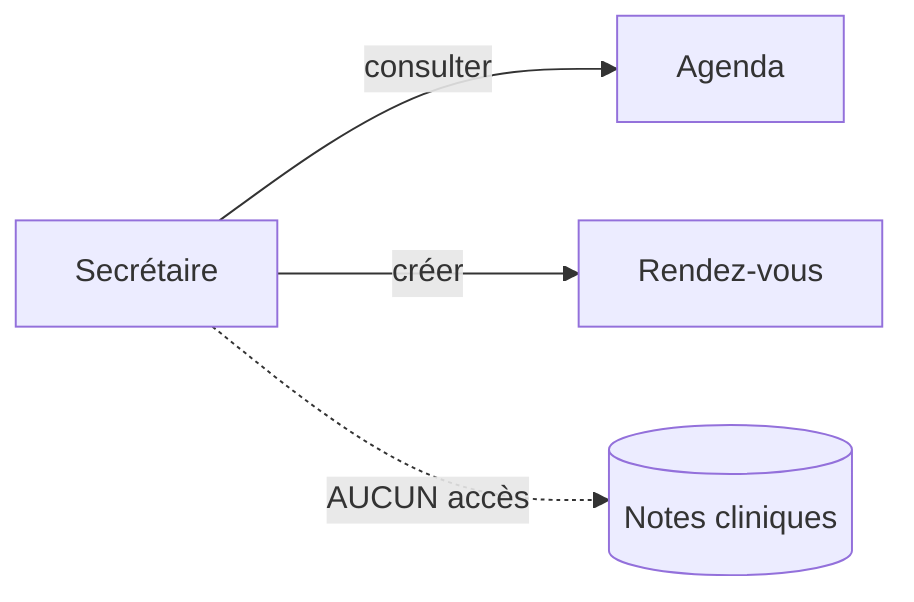

# Lugia & Co — Mermaid, WSF & Modélisation
> Document de référence technique · Mai 2026

---

## Objet du document

Ce document définit comment Lugia & Co utilise les diagrammes Mermaid pour représenter le Work System Framework (WSF) d'Alter. Il couvre : les types de diagrammes pertinents, leur articulation avec les 9 composantes WSF, les règles de modélisation, et les niveaux de zoom utiles au produit.

---

## Partie 1 — Le Work System Framework d'Alter

### Rappel de la structure

Le WSF modélise un système de travail en **9 composantes** organisées en pyramide :

```
                    CLIENTS
              (bénéficiaires)
                      ↕
              PRODUITS / SERVICES
                  (outputs)
                      ↕
   E      PROCESSUS & ACTIVITÉS        S
   N      (comment le travail          T
   V        est effectué)              R
   I            ↕    ↕    ↕             A
   R    ┌──────────────────────┐       T
   O    │ PARTICIPANTS         │       É
   N    │ INFORMATION          │       G
   N    │ TECHNOLOGIES         │       I
   E    └──────────────────────┘       E
   M                                   S
   T         INFRASTRUCTURE
              (le socle)
```

- **Les 6 éléments internes** (empilés) : Clients, Produits, Processus, et la rangée Participants / Information / Technologies
- **Les 2 côtés** : Environnement (gauche) et Stratégies (droite) — le contexte qui encadre
- **La base** : Infrastructure — le socle qui supporte tout

### Les 9 composantes

| Composante | Définition | Question |
|---|---|---|
| Participants | Qui fait le travail | Qui ? |
| Information | Données traitées/produites | Quelles données ? |
| Technologies | Outils utilisés | Quels outils ? |
| Processus | Comment le travail est fait | Comment ? |
| Produits/Services | Ce qui est produit | Quels outputs ? |
| Clients | Bénéficiaires de la valeur | Pour qui ? |
| Environnement | Contexte externe contraignant | Quelles contraintes ? |
| Stratégies | Orientations et objectifs | Pour quels buts ? |
| Infrastructure | Ressources partagées support | Sur quel socle ? |

---

## Partie 2 — Les types de diagrammes Mermaid

Mermaid propose une dizaine de types. Six sont réellement utiles pour le WSF.

### Flowchart — le plus universel



**Formes :**
| Syntaxe | Forme | Usage WSF |
|---|---|---|
| `[ ]` | Rectangle | Entité, acteur |
| `( )` | Arrondi | Processus, action |
| `{ }` | Losange | Décision |
| `[( )]` | Cylindre | Stock, base de données |
| `(( ))` | Cercle | Frontière, début/fin |
| `[/ /]` | Parallélogramme | Flux, entrée/sortie |
| `[\ \]` | Trapèze | Contrainte |

**Liaisons :**
| Syntaxe | Sens |
|---|---|
| `-->` | Flux direct |
| `---` | Association |
| `-.->` | Relation indirecte/optionnelle |
| `==>` | Flux principal/critique |
| `--o` | Agrégation |
| `--x` | Blocage |
| `<-->` | Interdépendance |

### Sequence Diagram — les interactions dans le temps



Idéal pour modéliser les interactions ordonnées dans le temps — chantiers, flux de valeur.

### Class Diagram — la structure des objets



Définit les objets, attributs, méthodes et relations. Fondation du schéma de données.

### State Diagram — les états et transitions



Modélise les états de santé, transitions, points de blocage.

### Entity-Relationship — les relations entre entités



Structure des données, cardinalités, dépendances.

### Quadrant Chart — le positionnement stratégique



Priorisation, alignement moyens/objectifs.

---

## Partie 3 — L'articulation Mermaid ↔ WSF

### Le principe directeur

> **Chaque composante WSF a un type de diagramme Mermaid qui la représente le mieux, selon la question qu'on lui pose.**

### La table de correspondance

| Composante WSF | Diagramme Mermaid | Question | Pourquoi |
|---|---|---|---|
| Clients | Flowchart | Qui reçoit la valeur ? | Flux de délivrance |
| Produits/Services | Flowchart | Que produit le système ? | Flux d'output |
| Processus | Sequence Diagram | Comment, dans quel ordre ? | Séquence temporelle |
| Participants | Class Diagram | Qui, quel rôle ? | Structure des rôles |
| Information | Entity-Relationship | Quelles données, quelles relations ? | Structure des données |
| Technologies | Class Diagram | Quels outils, quelles capacités ? | Structure des outils |
| Environnement | State Diagram | Quelles contraintes, quelles transitions ? | États conformité |
| Stratégies | Quadrant Chart | Objectifs alignés avec moyens ? | Priorisation |
| Infrastructure | Flowchart | Qu'est-ce qui supporte tout ? | Flux de support |

### La règle d'or

> **Un diagramme = une question à laquelle il répond.**

- Flowchart → *"Comment ça fonctionne ?"*
- Class/ER → *"Quelles données / quels objets ?"*
- Sequence → *"Comment ce chantier se déroule ?"*
- State → *"Quel est l'état de santé ?"*
- Quadrant → *"Par quoi commencer ?"*

Jamais deux diagrammes pour la même question. Jamais un diagramme pour plusieurs questions.

---

## Partie 4 — Les règles de modélisation

### Règles sur les objets

Tout objet appartient à une des 9 composantes et possède :
- Un **type** structurel (acteur, entité, stock, action, décision, flux, contrainte, frontière)
- Un **état** (optimal, fonctionnel, dégradé, à risque, bloqué, non documenté, en transformation, inactif)
- Une **criticité** (critique, important, standard, périphérique)
- Une **sensibilité** si c'est une Information (critique, élevée, modérée, standard, publique)

### Règles sur les liaisons

Chaque liaison a :
- Un **type** (utilise, produit, consomme, transforme, contraint, supporte, alimente, délivre, oriente, interface, remplace)
- Un **sens** (unidirectionnel, bidirectionnel)
- Une **force** causale (0.0 à 1.0)
- Un **délai** (immédiat, court, moyen, long terme)
- Un **caractère** (obligatoire, optionnel, conditionnel)
- Un **rôle** (pour les liaisons Participant → cible : ce que le participant a le droit de faire)

### Les rôles vivent dans les liaisons

Point de modélisation important : le rôle n'est pas une propriété du participant, mais un **attribut de la liaison** entre un participant et ce sur quoi il agit.



Cela permet de modéliser finement qui peut faire quoi, et de détecter les sur-accès (risque RGPD majeur).

### Règles de cohérence

- **R1 Typage** : chaque type de liaison n'est valide qu'entre certaines composantes (ex: UTILISE va de Participant vers Technologie)
- **R2 Frontière** : l'Environnement ne peut être que source de CONTRAINT, jamais cible
- **R3 Chaîne de valeur** : tout graphe valide contient un chemin Participant → Technologie → Information → Processus → Produit → Client
- **R4 Anti-cycle** : les boucles ne sont autorisées que marquées comme rétroaction
- **R5 Protection** : toute Information sensible qui sort du système (INTERFACE) doit passer par une Technologie de protection (le vault)

### Règles de rendu Mermaid

**Forme selon le type d'objet :**
```
ACTEUR      → A[nom]
ENTITE      → B[nom]
STOCK       → C[(nom)]
ACTION      → D(nom)
DECISION    → E{nom}
FLUX        → F[/nom/]
CONTRAINTE  → G[\nom\]
FRONTIERE   → H((nom))
```

**Style selon l'état (classDef) :**
```
OPTIMAL          → vert
FONCTIONNEL      → vert clair
DEGRADE          → ambre
A_RISQUE         → rouge clair
BLOQUE           → rouge
NON_DOCUMENTE    → gris pointillé
EN_TRANSFORMATION→ bleu
```

**Flèche selon la force :**
```
force >= 0.7   → ==>  (épaisse, critique)
force 0.3-0.7  → -->  (normale)
force < 0.3    → -.-> (pointillée, faible)
```

---

## Partie 5 — Les niveaux de zoom

### Les 5 niveaux du macro au micro

| Niveau | Vue | Diagramme | Question | Public |
|---|---|---|---|---|
| 0 | Vignette | Aucun (état) | Tout va bien ? | Médecin pressé |
| 1 | Pyramide WSF | Flowchart global | Comment c'est organisé ? | Médecin qui découvre |
| 2 | Domaine | Diagramme de la composante | Et dans ce domaine ? | Médecin qui explore |
| 3 | Flux de valeur | Sequence / Flowchart | Comment ça circule ? | Médecin qui optimise |
| 4 | Fiche objet | Détail + métadonnées | Et précisément ça ? | Médecin qui agit |

### Niveau 0 — Vignette
La vue la plus condensée. Un voyant de santé global. Aucun graphe.
> `● Cabinet en bonne santé · 2 points de vigilance`

### Niveau 1 — Pyramide WSF
Les 9 composantes dans la structure d'Alter. Santé et complétude de chacune.
Diagramme : flowchart pyramidal.

### Niveau 2 — Domaine
Zoom sur une composante. Tous ses objets, leurs relations internes.
Diagramme : selon la composante (class pour Technologies, ER pour Information…).

### Niveau 3 — Flux de valeur
Une chaîne complète à travers les composantes (ex: patient → compte-rendu).
Diagramme : sequence ou flowchart horizontal.

### Niveau 4 — Fiche objet
Le détail complet d'un objet : champs, état, criticité, liaisons, historique, chantier recommandé.

---

## Partie 6 — Les lentilles transversales

Ce ne sont pas des niveaux de zoom mais des **angles de lecture** du même modèle.

| Lentille | Coloration par | Question |
|---|---|---|
| Santé | État des objets | Où ça va mal ? |
| Conformité | Exposition réglementaire | Où suis-je à risque RGPD/AI Act ? |
| Données | Sensibilité des informations | Où sont mes données critiques ? |
| Maturité | Complétude du modèle | Que reste-t-il à cartographier ? |
| Charge/Temps | Charge de travail | Où part mon temps ? |
| Coût/Valeur | Coût ou valeur générée | Où est l'argent ? |
| Fragilité | Points de défaillance unique | Qu'est-ce qui me rend vulnérable ? |

Chaque lentille s'applique à tous les niveaux de zoom. La combinaison niveau × lentille donne la vue précise dont le médecin a besoin à un instant donné.

---

## Partie 7 — Les visualisations complémentaires

### Dynamiques (mouvement)
- **Propagation d'impact** : onde animée lors d'une simulation de changement
- **Découverte progressive** : la carte qui se révèle au fil de l'usage
- **Flux animé** : particules circulant le long des liaisons

### Non-graphe (autres formes)
| Forme | Pour quoi |
|---|---|
| Radar | Santé par composante |
| Barres de progression | Complétude par domaine |
| Quadrant | Priorisation des chantiers |
| Timeline | Évolution dans le temps |
| Liste priorisée | Désalignements à traiter |
| Matrice d'accès | Qui peut faire quoi |
| Récit narratif | Transformation accomplie |

---

## Partie 8 — Le mode focus (ego-network)

Quand on sélectionne une composante ou un objet, on peut isoler son **voisinage** :
- Tout ce qui entre (liaisons entrantes)
- Tout ce qui sort (liaisons sortantes)
- Le reste s'estompe

Répond à : *"De quoi dépend cet élément, et qu'est-ce qui dépend de lui ?"* — fondamental pour évaluer l'impact d'un changement avant de le faire.

---

## Synthèse — la matrice complète

```
              LENTILLES (angle de lecture)
              Santé · Conformité · Données · Maturité · Charge · Coût · Fragilité
              ─────────────────────────────────────────────────────────────────
NIVEAUX   0   Vignette        → voyant global
(zoom)    1   Pyramide WSF    → flowchart 9 composantes
          2   Domaine         → diagramme selon composante
          3   Flux de valeur  → sequence / flowchart
          4   Fiche objet     → détail + chantier

          + mode focus (ego-network) à chaque niveau
          + visualisations dynamiques (propagation, découverte, flux)
          + formes non-graphe (radar, timeline, quadrant, récit)
```

La règle qui gouverne tout :

> **Le bon niveau de zoom × la bonne lentille × le bon type de diagramme = la réponse à la question que le médecin se pose à cet instant.**

---

*Document de référence Mermaid & WSF — Lugia & Co — Mai 2026*
